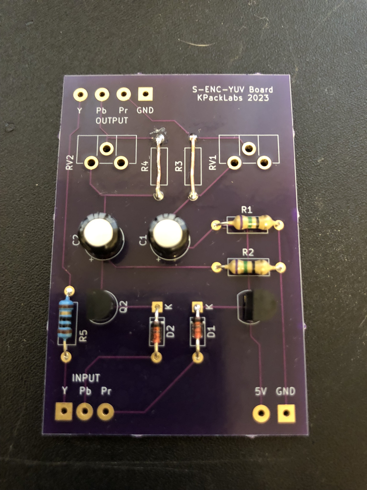
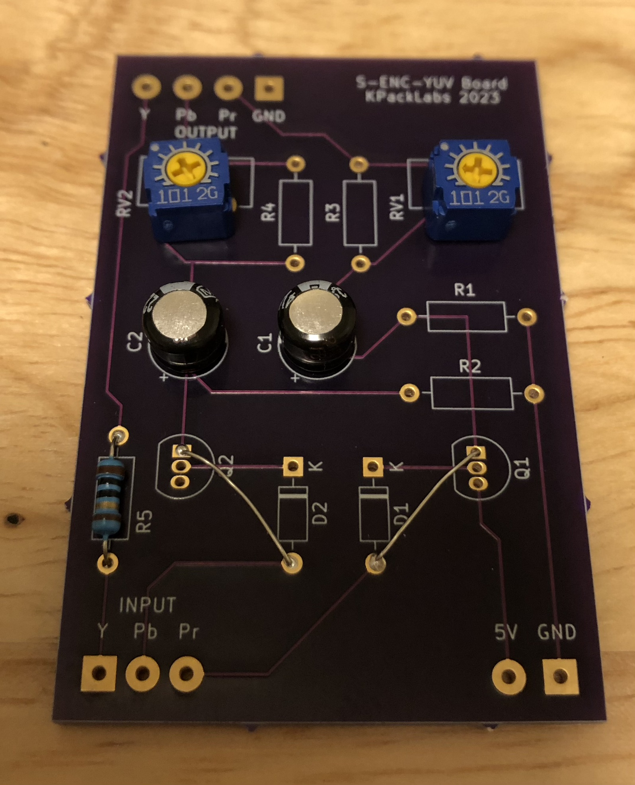
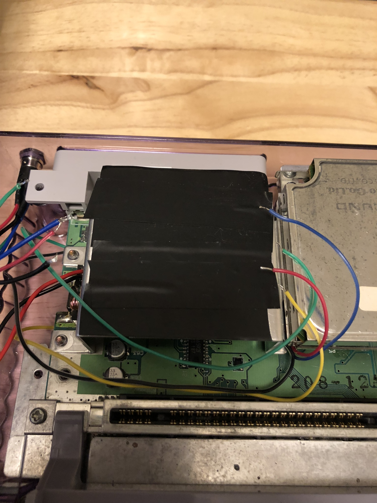
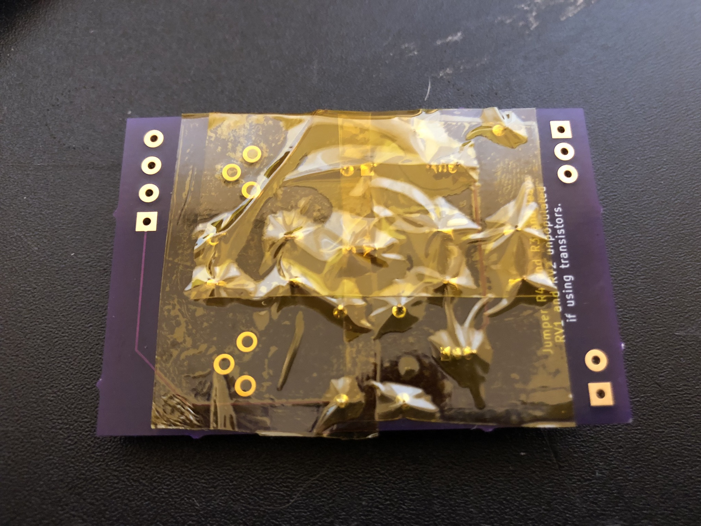
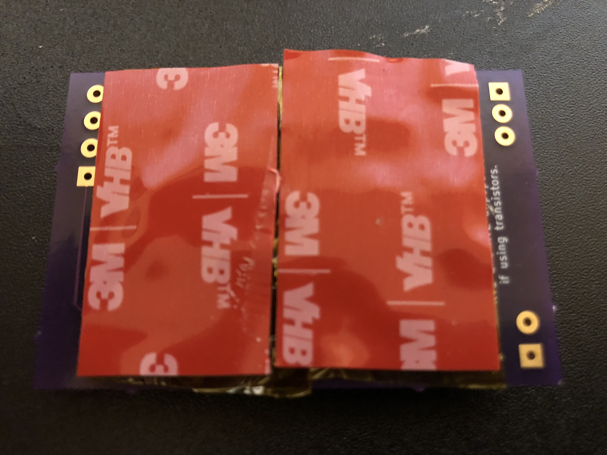
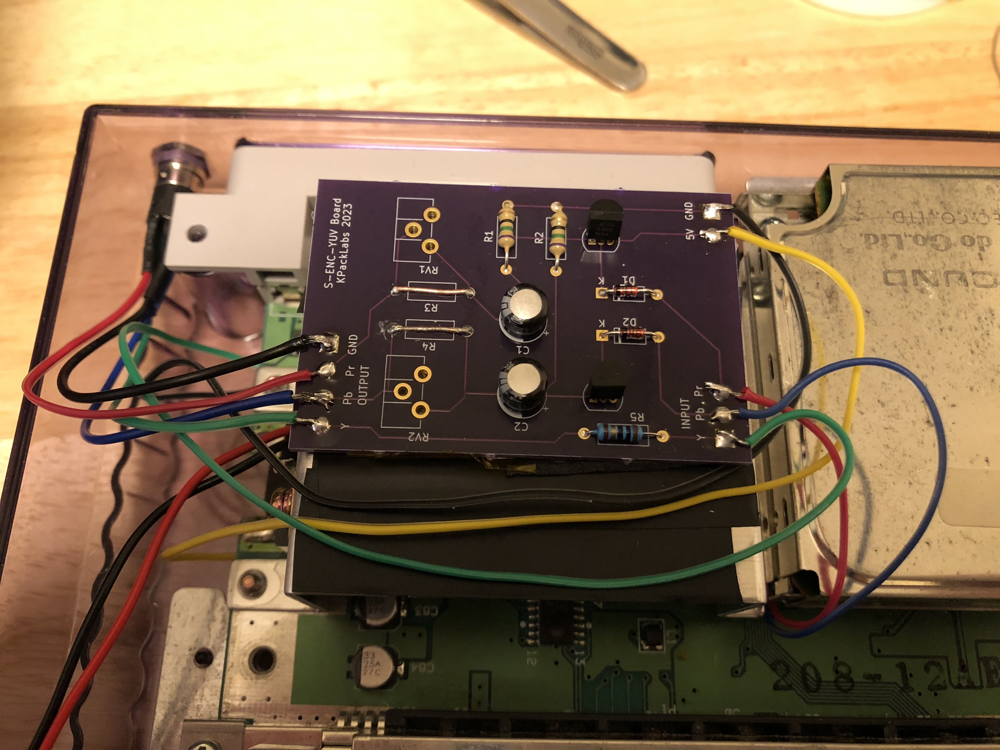

# S-ENC-YUV
A YPbPr mod kit for the first generation SNES and Super Famicom consoles utilizing the BA6592F and S-ENC (a.k.a. BA6594F) video encoder chips.

**IMPORTANT:** This mod is compatible with early SNES and Super Famicom console revisions (serial number beginning with UN272 or less) only. Later SNES and Super Famicom consoles which utilize the S-RGB encoder lack the Pb and Pr outputs necessary for this mod, therefore this mod will not work on later consoles.

Compatible revisions:
- SHVC-CPU-01
- SNS-CPU-GPM-01
- SNS-CPU-GPM-02
- SNSP-CPU-01
- SNSP-CPU-02

The SNES outputs at a 15KHz 240p resolution, which most modern HDTVs will not accept over Component YPbPr (even if it can accept it over Composite). Please refer to [this webpage](https://www.hdretrovision.com/240p) for a list of TVs that have been tested as well as instructions on how to determine if your set can accept a 240p input in the event you can't find your TV in the compatibility list. If your TV cannot accept 240p over Component, then you must use a dedicated video scaler (e.g. RetroTink 2X, RetroTink 5X, OSSC, Framemeister, or GBS Control) to upscale the 240p signal. Users of CRT SDTVs, PVMs, or BVMs may disregard this message.

------------

## Introduction

As more gamers discover the benefits that RGB has to offer over the bog-standard Composite, they are often faced with the confusion surrounding the available options for taking advantage of this feature. The first instinct would be to head on over to eBay or Amazon and buy the cheapest SCART cables they can find, only to be disappointed by the audio buzzing and interference caused by cheap unshielded cables. Higher quality options like HD Retrovision Component cables or SCART cables from Insurrection Industries, Retro Access, or Retro Gaming Cables tend to fluctuate in stock as more people buy them. This mod enables early SNES or Super Famicom console revisions to output YPbPr Component Video using a cheap readily available 3.5mm TRRS to 3x RCA cable in conjunction with the standard Nintendo Composite AV cables for sound.

------------

## Variations

There are multiple variations of the mod board to choose from based on the two different methods tested. The one to choose will vary on a variety of factors (such as your video encoder chip, console revision, or even your TV/Scaler's way of processing the image). Type A uses a transistor setup similar to the original AV output circuit of the SNES and is best suited for the BA6592F encoder (common on most SHVC-CPU-01 consoles), while Type B uses basic passive components and is suited best for the S-ENC encoder (common on all other compatible revisions). If you're not sure which one to use, order the advanced full-size board and test it with different configurations to see which one works best for you.

OSHPark links:
- [Advanced](https://oshpark.com/shared_projects/vhEn3k7J)
- [Mini Type-A](https://oshpark.com/shared_projects/ZWxqDEtu)
- [Mini Type-B](https://oshpark.com/shared_projects/uE9ANfrs)
- [Multi-Out Board for easy installation](https://oshpark.com/shared_projects/abuhMZIt)

It is recommended to order the small Multi-Out board with a 0.8 mm thickness.

-----------

## Output Cable

It is recommended to use an XBOX 360 E Composite AV cable (easy to find for cheap) in the following configuration:
- **Yellow**: Component Y
- **White**: Component Pb
- **Red**: Component Pr

When using the wiring configuration mentioned in the mod instructions, the cable will work as intended.

I've decided against using RCA jacks for this mod because the SHVC-CPU-01 revision does not have enough room to place them on the back panel as most of the space there is taken up by the sound module.

This cable will not provide audio. You must use your old Composite AV cables to provide the audio from the console.

-----------

## Board Assembly

Refer to the Bill of Materials (BOM) documents for each board depending on the one you'll be using. Populate the components accordingly to the correct locations and solder them into place. In addition to the parts listed in the corresponding BOM documents, you will need:
- Black, Red, Yellow, Green, and Blue colored wires (I recommend 28 AWG rainbow ribbon cable for this)
- Solid core wire or leads cut from a component
- Kapton tape or electrical tape
- Double-sided tape or adhesive pads
- A Game-bit screwdriver (for opening the console)
- A Philips screwdriver (for removing the screws that hold the motherboard in place)
- Heat shrink tubes
- Soldering iron
- Side cutters
- A drill with 2mm (5/16") and 6mm (1/4") drill bits
- Q-Tip (for cleaning any residing flux)
- Isopropyl alcohol (for cleaning any residing flux)

### Advanced Board Configurations

#### Type A:
- Leave R3, R4, RV1, and RV2 unpopulated.
- Jumper R3 and R4 with solid core wire or legs from a spare component.

#### Type B:
- Leave R1, R2, D1, D2, Q1, and Q2 unpopulated.
- Jumper the D1 anode pad to the Q1 emitter pad.
- Jumper the D2 anode pad to the Q2 emitter pad.

#### Type C (WIP):
- Assemble the board in the Type B configuration, wire the board to the console, test it, and adjust the pots until the image looks correct to you.
- After adjustments are made, measure the resistance on VR1 from the negative leg of C1 to the Pb output pad, and get the closest matching resistor. Make note of the resistance so you don't mistake one resistor for another.
- Measure VR2 resistance from the negative leg of C2 to the Pr output pad, and get the closest matching resistor. Make note of its resistance.
- Remove VR1 and VR2, and install the matching resistors for Pb into R3, and the resistor for Pr into R4.

------------

## Installation

WIP: Images to be added soon and instructions will improve gradually once I have the time to finish it.

Completely disassemble your SNES or Super Famicom console and inspect the video encoder chip to determine which configuration is suitable for your console. If yours is a BA6592F encoder, the Type-A configuration should provide the best results. If it's an S-ENC or a BA6594F, then the Type-B configuration should be sufficient.

Once you have decided which configuration to use based on your video encoder type, assemble the S-ENC mod board using the BOM (Bill of Materials) and the photos above as reference.

On the back of the console motherboard, solder the Multi-Out board onto the console's AV Multi-Out connector. Make sure you don't accidentally bridge any connections in the process. Use flux if you have any available. Gently remove residing flux with a Q-Tip and isopropyl alcohol when finished.

Solder the Yellow wire to the 5V pad (optional for Types B and C), the Green wire to the Y pad, and the Black wire to the GND pad.

Reinstall the bottom shield onto the SNES motherboard, and take care routing the wires from the Multi-Out board when doing so. Avoid routing the wires close to the screw posts as doing so may cause them to get pinched and short out as a result.

Turn the console motherboard onto the front, solder the red wire onto pin 1 of the video encoder chip (the bottom-left corner pin marked by the dot) and the blue wire onto pin 24 (the top-left corner pin). On some motherboard revisions, the numbers of the pins may be labeled, which makes it easier to tell where your wires need to go.

Reinstall the RF modulator shield onto place, reinsert the screws that hold it in place, and apply electrical or kapton tape on the side above the RF modulator/jack panel.

Apply Kapton tape onto the back of the mod board, then apply the double-sided tape/adhesive pad onto the same side.

Be sure to remove the backing on the double-sided tape once applied to the board.

Stick the mod board on top of the RF shield as close to the side facing the jack panel as possible, with the output pads facing left and the input pads facing right.

Place the wires onto the corresponding input pads and cut them to size so there's as little slack as possible.

**Color Guide:**
- Black: Ground
- Yellow: 5V (Not needed for Type B/C)
- Red: Pr
- Blue: Pb
- Green: Y

Once the wires are cut to size, strip them, then tin both the wire ends and the pads on the board. Solder the wires onto their corresponding pads.

Before drilling the hole for the 3.5mm jack, apply painter's tape on the right-side of the back of the shell, take the nut off the jack, place it on the bottom-right corner of the back of the shell (next to the power jack) with the outside of the nut on the edges of the corner, then use a pencil to draw the hole inside the nut on the tape. Once you have done this, use a ruler to draw lines in the middle of the hole to aid with drilling the pilot hole for the jack.

Use a small drill bit (5/16") to drill a hole on the right-side of the bottom shell where the 3.5mm jack will be mounted. Once the small hole is drilled, use an M7x0.75 (6mm or 1/4") drill bit to enlarge the hole. Take your time when drilling the holes and be careful not to drill too fast as the plastic can be brittle depending on how well the console has been taken care of during its lifetime. Test fit the jack and enlarge the hole slightly more if necessary.

Solder wires onto the jack on the following pins:
1. Green (Sleeve)
2. Blue (Tip)
3. Red (Ring 1)
4. Black (Ring 2)

Refer to the [SJ1-43502PM Datasheet](https://www.cuidevices.com/product/resource/sj1-43502pm.pdf) for pin locations.

Once you have the wires soldered onto the jack, it would be a good idea to add heat shrink tubes onto them to reduce stress on the wires and prevent any shorts.

Install the 3.5mm jack and the SNES motherboard in the bottom shell, run the wires from the jack onto the output pads on the mod board, cut the wires to size, strip the ends of the wires, tin both the mod board pads and the wires, and solder the wires onto the corresponding pads.

Once you have the board wired up, it may be a good idea to test the console to see if the mod works. If using the Type B configuration, adjust the potentiometers until the colors look correct.

If everything is working the way it should, you can reassemble the console and enjoy.

------------

## Credits

- Nicolas Livaditis
- thesteve
- Duo_R
- Michael Moffitt
- The Console5 Wiki
- The NESDev Forum
- The PC Engine-FX Forum
